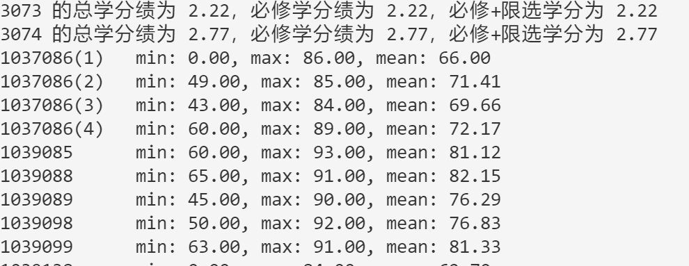

# Experiment 9

## 要求

使用第三方库xlrd、xlwt、xlutils、openpyxl、pandas、matplotlib、echarts等对附件成绩单情况进行分析汇总：计算各门课程的总分，该班级每门课程的平均分和最高分及最低分，并绘制相应的图形来统计各门课程的成绩分布，图形自选，标题，坐标轴标签，图例等属性设置完整。计算各同学的平均学分绩（分三种学分绩：总学分绩，必修学分绩，必修+限选学分绩），要求：有重修记录且最高分>=60分的课程成绩只能按60分计入；未通过的课程学分绩按0计入。学分绩为课程绩点与学分的成绩，绩点与成绩对应关系表如下：

| 成绩   | 60~69 | 70~79 | 80~89 | 90~100 |
| ------ | ----- | ----- | ----- | ------ |
| 学分绩 | 1~1.9 | 2~2.9 | 3~3.9 | 4~5    |

## 实现

实现了题目中的所有要求。

`read_excel` 函数从成绩单中读取数据，存入相应的数据结构中。因为存在着挂科重修的情况，而且挂科后绩点的计算方式和不挂科的绩点计算方式不同，需要对挂科的情况进行特殊处理。

对每个学生维护一个挂科课程的列表。因为考虑到重修后可能大于60分，那么如果有一行数据读到的成绩小于60，就把这门课程标记为挂科。一个学生可以多次修一个课程，那么就存这门课程最高的一次成绩。

```python
# 如果有一次该 course_id 的成绩低于60，标记为不及格课程
if int(score) < 60:
student[student_id]["failed_course"].append(course_id)

# 保留最高的一次成绩
if course_id in student[student_id]["score_list"]:
    if int(score) > int(student[student_id]["score_list"][course_id][0]):
		student[student_id]["score_list"][course_id][0] = score
else:
	student[student_id]["score_list"][course_id] = df.loc[i].values[3:6]
```

## 运行

### 各同学的平均学分绩：


因为成绩可能低于60分，题目中未定义60分以下的绩点如何计算。于是此处绩点为负数的表示成绩小于60分。

### 各门课程的总分，该班级每门课程的平均分和最高分及最低分



### 各门课程的成绩分布


